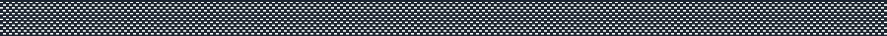

<link href="style.css" rel="stylesheet"></link>

    

## About me:

  ### Formacion:

 Estudiante de informática en la Universidad de La Plata (Argentina) y estudiante en Digital House en la carrera de Tech developer.
    También tengo una formación profesional en artes plásticas que obtuve al egresar del Bachillerato de Bellas Artes. 

 
    
  ### Lo que me gusta:  

 Soy un apasionado del desarrollo, me encanta dejar volar mi creatividad y utilizar la informática para materializar todo aquello 
    que se crea en mi mente, particularmente soy un fanático de los videojuegos y sobre todo de crearlos. 

    

    

                                               
## My best repos:                                              
 
<ul>                                               
 <li> <a href = "https://github.com/JulianPariss/WebGames">Frontend Proyects</a> </li>
 <li> <a href = "https://github.com/JulianPariss/WebPages">Frontend Proyects</a> </li>                                                         
</ul>     
                                                         

    

   

